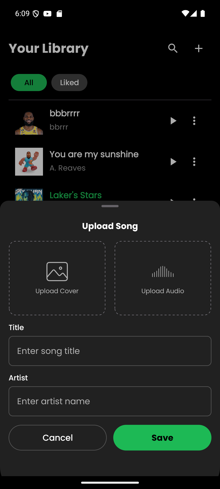

# Purrytify - Application Description
Purrytify is a android mobile app designed to stream music. User can add their own music and manage it by adding their music to favorite list. Purrytify support regular music player features such as shuffle, repeat, and queue song. Music can also play in the background.

# Library Used
- **Jetpack Compose** - Modern UI toolkit for native Android UI
- **Media3 ExoPlayer** - Media player for audio/video playback
- **Room** - SQLite database abstraction layer
- **Retrofit** - Type-safe HTTP client
- **Hilt** - Dependency injection libra

# Application Screenshot
## Login Screen

## Home Screen

## Library Screen

## Music Player

## Profile Screen

## Upload Music

## Edit Music

## App Context

# Work Distribution

## Moh Fairuz Alauddin Yahya (13522057)
- Library
- Music Player
- Network Sensing
- Shuffle
- Repeat
- Owasp
- Debugging

## Rayhan Fadhlan Azka (13522095)
- Header and Navbar
- Login
- Music Player
- Home
- Background Service
- Add Song
- Debugging
## Rayendra Althaf Taraka Noor (13522107)
- Mini Player
- Liked Songs
- Profile
- Queue
- Edit Song
- Logout

# Work hours
- Moh Fairuz Alauddin Yahya (13522057) : 10 hours
- Rayhan Fadhlan Azka (13522095) : 10 hours
- Rayendra Althaf Taraka Noor (13522107) : 10 hours
# OWASP Security Implementation

## M4: Insufficient Input/Output Validation

1. **Enhanced Song Repository Validation**

   - Make sure add validation for song title, artist, and file paths (not blank and not reach 100 characters, the existence of the song)
   - Implemented URI format verification (not blank, valid URI)
   - Established duration limits to prevent resource exhaustion (30 minutes for audio, non negative duration)

2. **Improved Login Validation**

   - Added proper email format validation (not blank, valid email, not reach 100 characters)
   - Implemented password length and complexity checks (not blank, between 6 and 100 characters)
   - Sanitized error messages to prevent information leakage (not expose errors details about 401, connection, and timeout)
   - Added client-side validation before network requests

## M8: Security Misconfiguration

1. **Network Security Configuration**

   - Created a network security configuration file to restrict cleartext traffic (add interceptor for auth guards, read timeout, connect timeout, prohibited follow redirects, doing retry connection failure )
   - Limited permitted connections to specific domains (only allow connections to trusted domains)

2. **Secure OkHttpClient Configuration**

   - Enforced modern TLS versions (TLS 1.2 and 1.3)
   - Added proper timeouts to prevent DoS vulnerabilities
   - Implemented proper SSL socket factory configuration
   - Added security headers to API requests

## M9: Insecure Data Storage

1. **Encrypted Token Storage**

   - Implemented Android Keystore for secure key management (production needs)
   - Added AES-GCM encryption for token storage
   - Created proper IV handling for each encryption operation
   - Implemented secure token deletion
